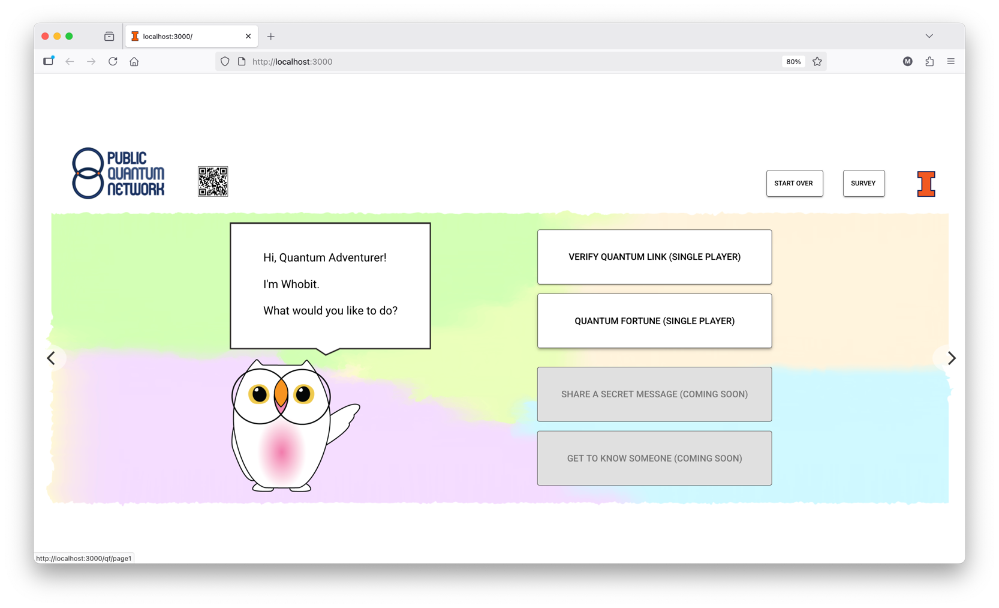
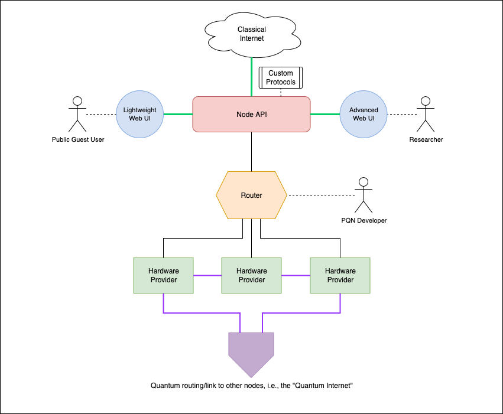

# pqn-node

**FastAPI node service for the Public Quantum Network (PQN)**

[](https://opensource.org/licenses/MIT)
[](https://www.python.org/downloads/)

Runs a PQN node: exposes the FastAPI routes used by the web UI, coordinates protocols between nodes, and orchestrates hardware through [`pqn-hardware`](https://github.com/PublicQuantumNetwork/pqn-hardware). Frontend lives in [pqn-gui](https://github.com/PublicQuantumNetwork/pqn-gui).

Hardware drivers, ZMQ messaging, and instrument protocols were extracted into [`pqn-hardware`](https://github.com/PublicQuantumNetwork/pqn-hardware) so that hardware and node work can evolve independently; `pqn-node` pulls it in as a git-pinned dependency.

<p align="center">
  
  <br>
  <em>PQN web interface for public interaction with a quantum network</em>
</p>

> [!WARNING]
> **Early Development**: This package is in early stages of development. APIs, installation procedures, and distribution methods are subject to change. Use in production environments is not recommended at this time.

## Node Architecture

<p align="center">
  
  <br>
  <em>PQN web interface for monitoring and controlling quantum network nodes</em>
</p>

A Node's components share an internal intranet with no external access except for quantum links to other hardware or the _Node API_.

* **Node API** (this repo): FastAPI service that handles web-UI and node-to-node communication. The only component in a Node that can talk to other components and the outside world. Entry point: `src/pqn_node/main.py`. See the [FastAPI docs](https://fastapi.tiangolo.com/deployment/) for deployment options.
* **Lightweight Web UI**: For the general public to interact with quantum networks. Lives at [pqn-gui](https://github.com/PublicQuantumNetwork/pqn-gui).
* **Router** (in `pqn-hardware`): Routes ZMQ messages between _Hardware Providers_, developers, and _Node APIs_.
* **Hardware Provider** (in `pqn-hardware`): Hosts hardware resources and exposes them through ProxyInstruments.

## Quick Start

> [!NOTE]
> **Hardware Requirements**: To do anything interesting with this software currently requires real quantum hardware components (TimeTagger, rotators, etc.). We are actively working on fully simulated hardware components to enable single-machine demos without physical devices, but this capability is not yet available.

### Prerequisites

- Python 3.12 or higher
- [uv](https://docs.astral.sh/uv/) package manager
- Quantum hardware components (TimeTagger, compatible instruments)

### Installation

```bash
git clone https://github.com/PublicQuantumNetwork/pqn-node.git
cd pqn-node
uv sync
```

`uv sync` fetches `pqn-hardware` at the pinned commit from its GitHub repo.

### Start a Node

To fully start a PQN Node, four processes are typically needed:

* **PQN API** (this repo)
* **Router** (from `pqn-hardware`)
* **Hardware provider** (from `pqn-hardware`, optional)
* **Web GUI** (optional)

### Set up the PQN API

#### Config file

Before starting a Node API, set up a configuration file:

1. **Copy the example configuration:**
   ```bash
   cp configs/config_example.toml config.toml
   ```

> [!IMPORTANT]
> The configuration file **must** be named `config.toml` and placed at the root of the repository. If you use a different name or location, the API will not be able to find it.

2. **Edit the configuration:**
   Open `config.toml` in your editor and replace the placeholder values with your actual settings (router addresses, instrument names, etc.).

### Configure Router and Hardware Provider

Router and provider live in the `pqn-hardware` package. See [pqn-hardware's README](https://github.com/PublicQuantumNetwork/pqn-hardware#quick-start) for their config format. On the first computer on the PQN, both a router and a provider are needed; subsequent computers only need a provider.

Start the router:

```bash
uv run pqn-hw start-router --config configs/router_provider.toml
```

Start the hardware provider:

```bash
uv run pqn-hw start-provider --config configs/router_provider.toml
```

### Start the PQN API server

```bash
uv run fastapi run src/pqn_node/main.py
```

Browse protocols at http://127.0.0.1:8000/docs.

### Daily report

Run or schedule the Slack health-report digest:

```bash
uv run pqn-node daily-report run
uv run pqn-node daily-report schedule
```

### Install the Web GUI

See [pqn-gui](https://github.com/PublicQuantumNetwork/pqn-gui) for install and start instructions.

## Acknowledgements

The Public Quantum Network is supported in part by NSF Quantum Leap Challenge Institute HQAN under Award No. 2016136, Illinois Computes, and by the DOE Grant No. 712869, "Advanced Quantum Networks for Science Discovery."

## Have questions?

Contact the PQN team at publicquantumnetwork@gmail.com.
